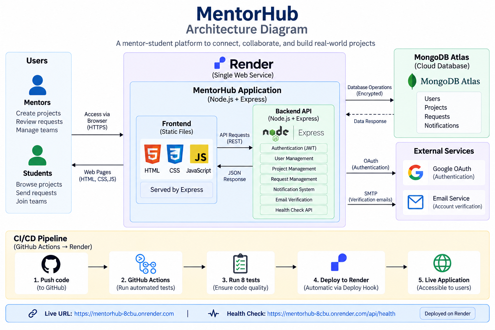

# MentorHub

MentorHub is a mentor–student platform that helps students discover real-world project opportunities and connect with mentors. Mentors can create projects, manage student requests, and track project members, while students can explore projects and request to join them.

## Features

- Student and mentor role-based access
- User registration and login
- JWT-based authentication
- Google Login
- Email verification for account registration
- Mentor project creation and management
- Students can browse projects by domain
- Student project requests
- Mentor request acceptance/rejection
- Project member capacity tracking
- Notifications for request updates
- Email-based communication
- RESTful backend APIs
- Health-check endpoint for deployment monitoring

## Tech Stack

### Frontend
- HTML
- CSS
- JavaScript

### Backend
- Node.js
- Express.js
- REST APIs

### Database
- MongoDB
- MongoDB Atlas
- Mongoose

### Authentication & Services
- JWT
- bcryptjs
- Google Identity Services
- Nodemailer

### DevOps
- Git
- GitHub
- GitHub Actions
- Render

## Architecture

```text
                         ┌──────────────────────┐
                         │       User           │
                         │ Student / Mentor     │
                         └──────────┬───────────┘
                                    │
                                    ▼
                         ┌──────────────────────┐
                         │   MentorHub Frontend │
                         │      HTML/CSS/JS     │
                         └──────────┬───────────┘
                                    │ HTTP/REST
                                    ▼
                         ┌──────────────────────┐
                         │   Express.js API     │
                         │      Node.js         │
                         └──────────┬───────────┘
                                    │
                 ┌──────────────────┼──────────────────┐
                 ▼                  ▼                  ▼
        ┌────────────────┐  ┌────────────────┐  ┌────────────────┐
        │ Authentication │  │ Project/Request│  │ Notifications  │
        │   & JWT        │  │    APIs        │  │     APIs       │
        └────────────────┘  └────────────────┘  └────────────────┘
                 │                  │                  │
                 └──────────────────┼──────────────────┘
                                    ▼
                         ┌──────────────────────┐
                         │    MongoDB Atlas     │
                         └──────────────────────┘
```

The Express server also serves the frontend as static files, so the deployed application runs from a single Render web service.

## Project Structure

```text
MentorHub/
├── backend/
│   ├── config/
│   ├── controllers/
│   ├── middleware/
│   ├── models/
│   ├── routes/
│   ├── utils/
│   ├── tests/
│   ├── .env
│   ├── .env.example
│   ├── app.js
│   ├── server.js
│   ├── package.json
│   └── package-lock.json
│
├── frontend/
│   ├── js/
│   └── ...
│
├── .github/
│   └── workflows/
│       └── ci.yml
│
├── .gitignore
└── README.md
```

## Running Locally

### 1. Clone the repository

```bash
git clone <your-github-repository-url>
cd MentorHub
```

### 2. Install backend dependencies

```bash
cd backend
npm ci
```

### 3. Configure environment variables

Create a `.env` file inside `backend/` using `.env.example` as a template.

Required configuration includes:

```env
PORT=5000
MONGO_URI=your_mongodb_connection_string
BACKEND_URL=http://localhost:5000
JWT_SECRET=your_jwt_secret

EMAIL_HOST=your_email_host
EMAIL_PORT=your_email_port
EMAIL_USER=your_email_address
EMAIL_PASS=your_email_password_or_app_password

GOOGLE_CLIENT_ID=your_google_client_id
GOOGLE_CLIENT_SECRET=your_google_client_secret
```

Do not commit the real `.env` file or any credentials to GitHub.

### 4. Start the application

```bash
npm start
```

The application runs locally on:

```text
http://localhost:5000
```

## API Overview

The backend exposes REST API routes under:

```text
/api/auth
/api/projects
/api/requests
/api/notifications
```

A basic API test endpoint is available at:

```text
GET /api/test
```

The health-check endpoint is:

```text
GET /api/health
```

Expected health response:

```json
{
  "status": "ok",
  "message": "MentorHub backend is healthy"
}
```

## Authentication

MentorHub uses JWT for authenticated API access.

The authentication flow is:

```text
Login / Google Login
        ↓
Backend validates credentials
        ↓
JWT generated
        ↓
Client uses JWT for protected requests
        ↓
Authentication middleware verifies JWT
        ↓
Protected API resource
```

Role information is included in the authenticated user data so that mentor- and student-specific operations can be controlled.

## Email Verification

For normal registration, the backend generates an email verification token and sends a verification email using Nodemailer.

The verification link is generated from the configured `BACKEND_URL`.

## Testing

The backend contains automated API validation tests using Node's test runner and Supertest.

Run:

```bash
npm test
```

Current CI validation includes **8 passing tests**, covering:

- API availability
- Health check
- Registration validation
- Login validation
- Protected profile access
- Role validation
- Email verification token validation
- Google authentication credential validation

## CI/CD

GitHub Actions is used to automatically validate changes pushed to the repository.

Current workflow:

```text
Git Push
   ↓
GitHub Actions
   ↓
Install dependencies
   ↓
Run automated tests
   ↓
Successful build/check
   ↓
Render deployment
   ↓
Live MentorHub application
```

The project uses a Render Web Service for deployment.

## Deployment

MentorHub is deployed on Render.

Live application:

https://mentorhub-8cbu.onrender.com

The deployed service uses:

```text
Build Command: npm ci
Start Command: npm start
Root Directory: backend
```

MongoDB Atlas is used as the cloud database.

Environment variables and secrets are configured through the deployment platform rather than stored in the repository.

## Reliability

The backend includes:

- Request validation
- Authentication checks
- Role and ownership checks
- HTTP status codes for client/server errors
- `try/catch` error handling in controllers
- Health-check endpoint
- Production logs through the deployment platform

## Security Practices

- JWT secret stored as an environment variable
- Database credentials stored as environment variables
- Email credentials stored as environment variables
- Google OAuth credentials stored as environment variables
- `.env` files excluded through `.gitignore`
- `.env.example` contains only placeholder values

## DevOps Workflow

The project follows a basic DevOps workflow:

```text
Develop
   ↓
Git
   ↓
GitHub
   ↓
GitHub Actions
   ↓
Automated API Tests
   ↓
Render
   ↓
Production
```

This allows code changes to be version-controlled, automatically tested, and deployed to the live environment.

## Future Improvements

Possible future improvements include:

- More comprehensive automated test coverage
- More detailed application monitoring
- Improved production security configuration
- Containerization with Docker
- Additional CI/CD quality gates


